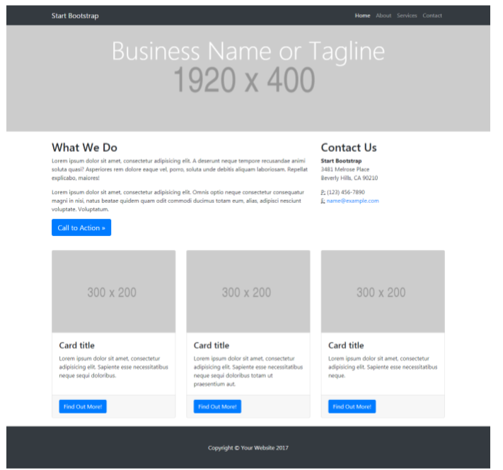
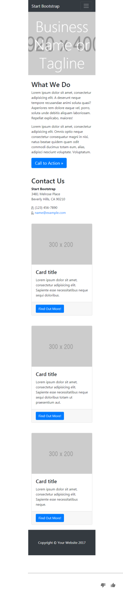
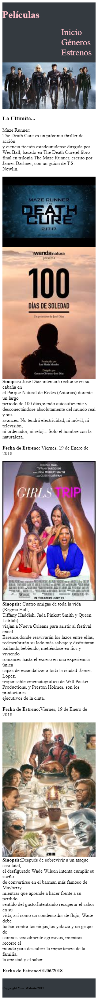

### Reto: Mi página web ###

-------------------------------------------------

1) **Objetivo**

Para este reto nos piden que creemos una página web con la siguiente estructura:

De forma que se pueda visualizar para diferentes dispositivosen este caso celulares y laptops respectivamente,imagen a continuación:

2) ** Desarrollo**

2.1 Para la parte del html se ingresa una etiqueta para la parte del footer(encabezado en la web)luego una sección donde se encontrará un artículo acompañada de una imagen referencialluego sigue otra sección que en ese caso se encuentran tres divs contenedores y finaklmente un footer(pie de página)

2.2 Para la parte del css le di color al header y footer color a las letras del footer.

2.3 Con el gris system lo utilizé para que se vea en dispositivos móviles
 para lo que ingresé los valores calculados en css y el html coloqué las clases correspondientes a estas col-xs(para dispositivos móviles de hasta 768px) y col-md (para dispositivos tipo laptops con un ancho de hasta 992px).

2.4 El resultado que obtengo es el siguiente, para móviles:

